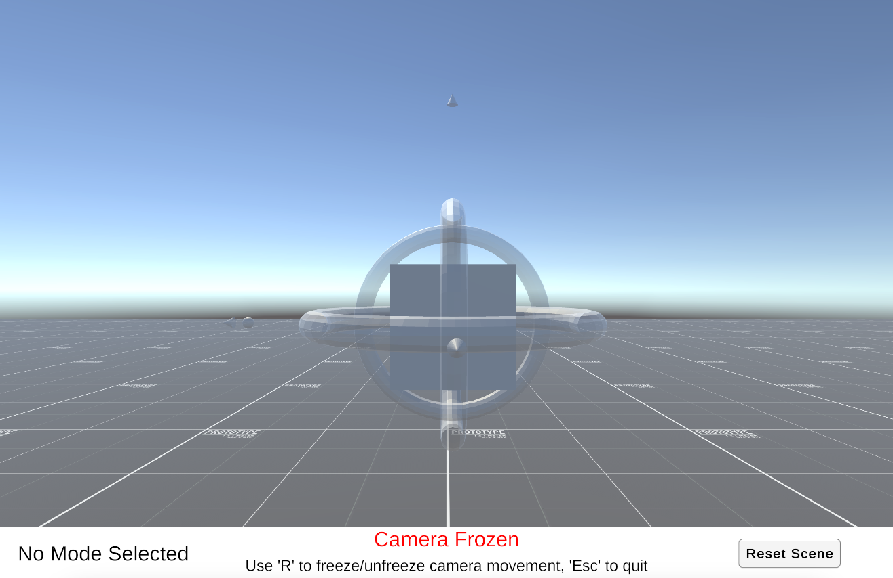
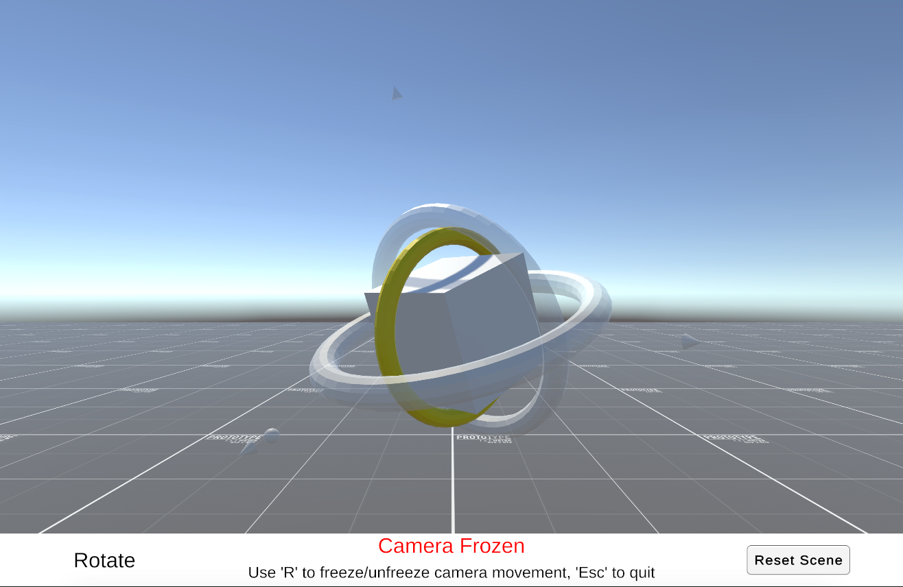
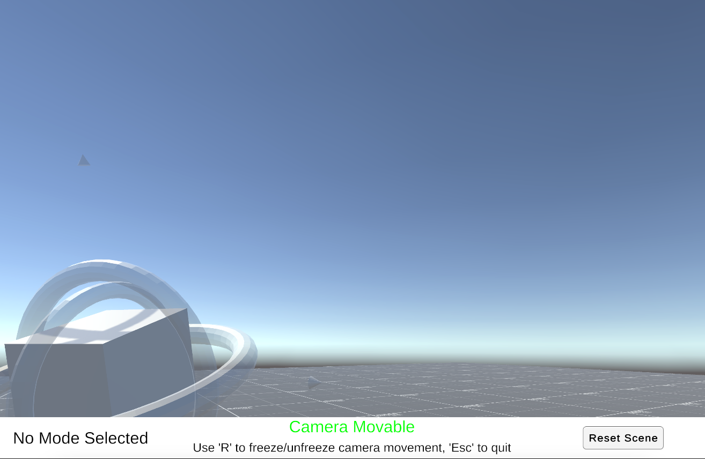

# Unity Gimbals

This is a sample project to play around with the use of gimbals in Unity. 

There are three modes, with additional support for camera movement:
- Scale
- Rotate
- Transform

The `MainScene` is available under `Assets -> _Project -> Scenes`

The camera is initially fixed, and this can be toggled using the 'R' key. When movable, we can use the WASD keys and the mouse to control the camera. 

Below are some screenshots

## Project Details

This project is built using Unity 2020.3.42f for PC/Mac/Standalone platform, and has been tested on a MacBook Pro (Apple Silicon)

The grid texture for the Plane below has been sourced from Unity Marketplace. The (rather crude) models for torus and the cone have been made by me in Blender.

### Build Instructions

The project has been tested on a Mac, but should work the same on a Windows machine too. To take a build, simply go to `File -> Build Settings`, set the platform to `PC, Mac and Standaloen`, make sure MainScene is included in the list of scenes, and then do `Build and Run`.